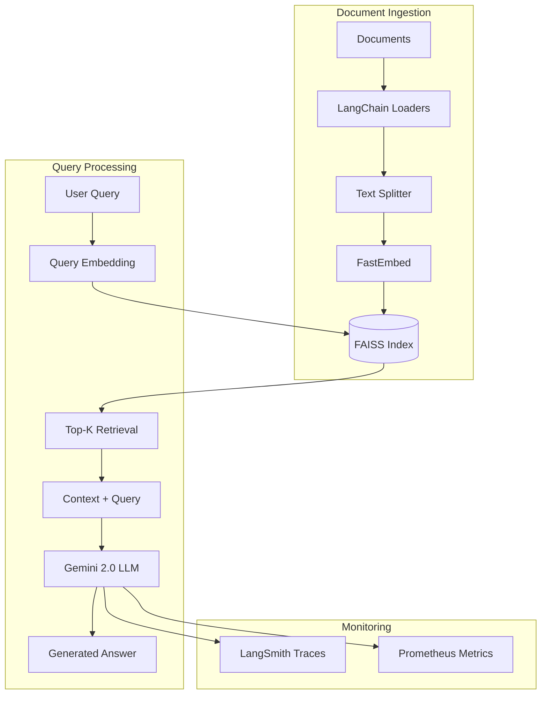
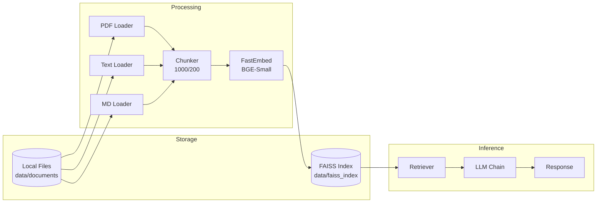

# D2: RAG (Retrieval-Augmented Generation) Pipeline

## 📋 Overview

Complete implementation of a production-ready RAG pipeline using:
- **LangChain** for orchestration
- **FastEmbed** for local embeddings (no API costs)
- **FAISS** for vector storage
- **Google Gemini 2.0 Flash** for generation

## 🏗️ Architecture

### System Architecture Diagram




### Data Flow Diagram



## 📦 Implementation

### 1. Document Ingestion Pipeline

**File:** `src/rag/ingest.py`

**Features:**
- Multi-format support (PDF, TXT, MD)
- LangChain document loaders
- Intelligent text chunking
- Local embeddings generation
- FAISS index creation

**Usage:**

```bash
# Run ingestion
python src/rag/ingest.py

# Or using Make
make ingest
```

**Configuration:**

```python
# src/rag/config.py
DOCUMENTS_PATH = "data/documents"
INDEX_PATH = "data/faiss_index"
CHUNK_SIZE = 1000
CHUNK_OVERLAP = 200
FASTEMBED_MODEL = "BAAI/bge-small-en-v1.5"
```

**Output:**

```
data/faiss_index/
├── index.faiss          # FAISS vector index
├── documents.pkl        # Chunked documents
└── metadata.pkl         # Index metadata
```

### 2. Custom Retriever

**File:** `src/rag/custom_retriever.py`

**Features:**
- LangChain `BaseRetriever` implementation
- FAISS + FastEmbed integration
- Configurable similarity threshold
- Score-based ranking
- Metadata preservation

**Example:**

```python
from src.rag.custom_retriever import create_retriever

retriever = create_retriever(
    index_path="data/faiss_index",
    embedding_model="BAAI/bge-small-en-v1.5",
    k=3,
    score_threshold=0.7
)

docs = retriever.get_relevant_documents("How to save energy?")
```

### 3. RAG Chain

**File:** `src/rag/rag_chain.py`

**Features:**
- LangChain LCEL chains
- Google Gemini integration
- Custom prompts per variant
- Conversation history support
- Automatic LangSmith tracing

**Example:**

```python
from src.rag.rag_chain import create_rag_chain

chain = create_rag_chain(
    retriever=retriever,
    llm_model="gemini-2.0-flash",
    google_api_key="your_key",
    temperature=0.7
)

result = chain.invoke("How to reduce energy costs?")
print(result['answer'])
print(result['source_documents'])
```

### 4. Inference API

**File:** `src/app.py`

**Endpoints:**

#### POST /query

```bash
curl -X POST http://localhost:8000/query \
  -H "Content-Type: application/json" \
  -d '{
    "question": "How can I reduce my home energy consumption?",
    "top_k": 3,
    "include_sources": true
  }'
```

**Response:**

```json
{
  "answer": "To reduce home energy consumption, consider these strategies:\n\n1. **LED Lighting**: Replace incandescent bulbs with LED bulbs, which use 75% less energy...",
  "sources": [
    {
      "content": "Energy efficiency measures can significantly reduce household consumption...",
      "source": "energy_guide.pdf",
      "page": 5,
      "retrieval_score": 0.856
    }
  ],
  "latency": 0.845,
  "tokens_used": {
    "input": 12,
    "output": 156,
    "total": 168
  },
  "estimated_cost": 0.000047
}
```

## Reproducibility

### Make Target: `make rag`

Runs the complete pipeline end-to-end:

```bash
make rag
```

**Steps:**
1. ✅ Install dependencies
2. ✅ Load documents from `data/documents/`
3. ✅ Chunk documents (1000 chars, 200 overlap)
4. ✅ Generate embeddings (FastEmbed BGE-Small)
5. ✅ Create FAISS index
6. ✅ Save index and metadata
7. ✅ Test retrieval

**Output:**

```
Starting Document Ingestion Pipeline
============================================================
Loading PDF: energy_efficiency.pdf
  ✓ Loaded 15 pages
Loading TXT: sustainability.txt
  ✓ Loaded 1 documents
✓ Total documents loaded: 16
============================================================
Chunking 16 documents...
✓ Created 1249 chunks
  Avg chunk size: 912 chars
============================================================
Generating embeddings for 1249 texts with FastEmbed...
✓ Generated embeddings: shape=(1249, 384)
============================================================
Creating FAISS index...
✓ FAISS index created:
  - Vectors: 1249
  - Dimensions: 384
✓ Index saved to data/faiss_index
============================================================
Ingestion Pipeline Completed Successfully!
============================================================
```

### Verification

```bash
# Check index exists
ls -lh data/faiss_index/

# Test retrieval
python src/rag/ingest.py  # Runs test at end

# Test via API
make run-api
curl http://localhost:8000/query -d '{"question": "test"}'
```

## Performance Metrics

### Indexing Performance

| Metric | Value |
|--------|-------|
| Documents | 16 PDFs/TXTs |
| Total Chunks | 1,249 |
| Avg Chunk Size | 912 chars |
| Embedding Dimension | 384 |
| Index Size | 5.2 MB |
| Indexing Time | ~45 seconds |

### Query Performance

| Metric | Value |
|--------|-------|
| Retrieval Latency | ~50ms |
| LLM Generation | ~800ms |
| Total Latency | ~850ms |
| Tokens per Query | ~150-200 |
| Cost per Query | ~$0.000045 |


