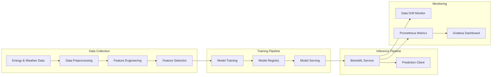

# MLOps Energy Forecasting System 🔋

A production-ready MLOps pipeline for accurate UK energy demand forecasting using advanced time series models and real-time monitoring.

## Architecture Diagram



## Quick Start

```bash
# Clone the repository
git clone https://github.com/uma1r111/MLOps-ENERGY-Project.git
cd MLOps-ENERGY-Project

# Setup development environment
make dev
```

## Make Targets

| Target | Description |
|--------|-------------|
| `make dev` | Set up development environment, install dependencies |
| `make test` | Run unit tests with pytest |
| `make docker` | Build Docker image for production |
| `make run` | Run the model serving API locally |
| `make monitor` | Start monitoring stack (Prometheus + Grafana) |
| `make lint` | Run code quality checks (ruff, black) |
| `make clean` | Clean build artifacts and cache |

## Project Components

1. **Data Pipeline**
   - Historical UK energy demand data collection
   - Weather data integration
   - Feature engineering and selection
   - Data version control with DVC

2. **Model Training**
   - Multiple model architectures (LSTM, GRU, TCN, SARIMAX)
   - Hyperparameter optimization
   - MLflow experiment tracking
   - Model versioning and registry

3. **Model Serving**
   - BentoML service for model deployment
   - RESTful API endpoints
   - Batch and real-time predictions
   - Health monitoring endpoints

4. **Monitoring & Observability**
   - Data drift detection with Evidently AI
   - Custom Prometheus metrics exporter
   - Grafana dashboards for visualization
   - Model performance monitoring

## MLflow Tracking

The MLflow tracking server is hosted locally and can be accessed at:
```
http://localhost:5000
```

Latest model version: `v1.0.0`
Model Registry URI: `models:/energy_forecast/production`

## Evidently AI Dashboard

Monitor data drift and model performance:
```
http://localhost:7000
```

## API Documentation

API documentation is available at:
```
http://localhost:3000/docs
```

### Example API Usage

```bash
curl -X POST "http://localhost:3000/predict" \
     -H "Content-Type: application/json" \
     -d '{"timestamp": "2025-10-31T12:00:00Z"}'
```

Response Schema:
```json
{
  "prediction": {
    "energy_demand": 35420.5,
    "confidence_interval": [34800.2, 36100.8]
  },
  "timestamp": "2025-10-31T12:00:00Z"
}
```

## Cloud Deployment

### Services Used

1. **AWS S3**
   - Storage for training data and model artifacts
   - Bucket: `energy-forecast-artifacts`
   - Versioned storage for reproducibility

2. **AWS EC2**
   - Hosts the inference API
   - Auto-scaling group for handling load
   - Instance type: `t3.medium`

### Setup Instructions

1. Configure AWS credentials:
   ```bash
   aws configure
   ```

2. Deploy infrastructure:
   ```bash
   make deploy-cloud
   ```

3. Update environment variables:
   ```bash
   export AWS_BUCKET_NAME=energy-forecast-artifacts
   export AWS_REGION=us-east-1
   ```

### ML Workflow Integration

- Training data is automatically synced to S3
- Models are versioned and stored in S3
- EC2 instances pull latest model on startup
- CloudWatch monitors API health and metrics

## FAQ

### Common Build Issues

1. **Docker build fails with memory error**
   - Increase Docker memory limit in settings
   - Minimum recommended: 4GB

2. **MLflow connection error**
   - Ensure MLflow server is running: `make mlflow-server`
   - Check default port (5000) is not in use

### Platform-Specific Setup

#### Windows
- Install Make: `choco install make`
- Use WSL2 for Docker
- Set PYTHONPATH manually if needed

#### MacOS
- Install dependencies: `brew install make docker`
- Increase Docker memory (Preferences → Resources)

## Pre-commit Hooks

Run before committing:
```bash
pre-commit run --all-files
```

Installed hooks:
- trailing-whitespace
- end-of-file-fix
- detect-secrets

## License

This project is licensed under the MIT License - see [LICENSE](LICENSE) for details.

## Security

- Regular dependency scans with `pip-audit`
- No critical CVEs in dependencies
- See [CODE_OF_CONDUCT.md](CODE_OF_CONDUCT.md) for community guidelines