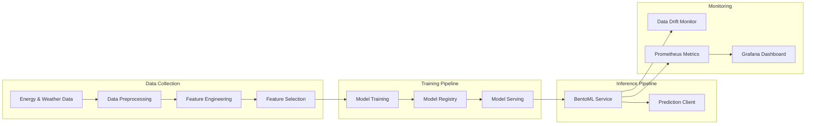

# MLOps Energy Forecasting System 🔋

UK energy demand forecasting system with real-time monitoring and automated ML pipeline deployment.

## Architecture Diagram

*Data Flow and System Architecture*



## Quick Start

```bash
# Clone the repository
git clone https://github.com/uma1r111/MLOps-ENERGY-Project.git
cd MLOps-ENERGY-Project

# Setup development environment
make dev
```

## Make Targets

| Target | Description |
|--------|-------------|
| `make dev` | Set up development environment, install dependencies |
| `make test` | Run unit tests with pytest |
| `make docker` | Build BentoML service Docker image |
| `make serve` | Serve BentoML model locally |
| `make bentoml-build` | Build model as deployable Bento |
| `make monitor` | Start monitoring stack (Prometheus + Grafana) |
| `make lint` | Run code quality checks (ruff, black) |
| `make clean` | Clean build artifacts and cache |

## ML Workflow Monitoring

### MLflow Tracking
MLflow tracking server: `http://localhost:5000`
- Latest model version: `v1.0.0` (registered in MLflow)
- Model Registry URI: `models:/energy_forecast/production`


### Data Drift Monitoring
Evidently AI Dashboard for data drift monitoring: `http://localhost:7000`


### Metrics Monitoring
Prometheus + Grafana metrics dashboard: `http://localhost:3100`


Key metrics being tracked:
- **API Performance**
  - Total API endpoints: 3
  - API success rate: 100%
  - Average response time: 0.584s
  
- **Model Performance**
  - Current best model: Final_GRU
  - RMSE: 0.0713
  - MAE: 0.0489
  
- **System Metrics**
  - Training duration
  - Last execution timestamp
  - Model serving status

## Cloud Deployment

### AWS Services Integration

Our ML pipeline utilizes two main AWS services:

1. **AWS S3 for Data and Model Storage**
   
   - Stores training data and model artifacts
   - Enables versioned storage for reproducibility
   - Facilitates team collaboration

2. **AWS EC2 for Model Serving**
   
   - Hosts the inference API
   - Auto-scaling group for handling load variations
   - Continuous monitoring via CloudWatch

### Service Architecture


## Model Serving & API Documentation

BentoML Service endpoint available at: `http://localhost:3000`


Service includes:
- Automatic OpenAPI documentation
- Built-in model monitoring
- Request logging and metrics
- Docker/Kubernetes deployment ready

Example usage:
```bash
# Using bentoml CLI
bentoml serve service:svc --production

# API request
curl -X POST "http://localhost:3000/predict" \
     -H "Content-Type: application/json" \
     -d '{"timestamp": "2025-10-31T12:00:00Z"}'
```

### Model Deployment
```bash
# Build model as deployable Bento
bentoml build

# Containerize the Bento
bentoml containerize energy_forecast:latest
```

The service is automatically packaged with:
- Model artifacts
- Python dependencies
- API configuration
- Environment settings

## FAQ

### Common Build Issues

1. **Docker build fails**
   - Increase Docker memory limit (recommended: 4GB)
   - Run `docker system prune` to clear space
   - Check Docker daemon is running

2. **Package installation errors**
   - Update pip: `python -m pip install --upgrade pip`
   - Install build tools: `apt-get install build-essential` (Linux)
   - Use Python 3.11 as specified in Dockerfile

### Platform Setup

#### Windows
1. Install WSL2: `wsl --install`
2. Install Docker Desktop with WSL2 backend
3. Install Make: `choco install make`
4. Install Python 3.11

#### MacOS
1. Install Homebrew: `/bin/bash -c "$(curl -fsSL https://raw.githubusercontent.com/Homebrew/install/HEAD/install.sh)"`
2. Install dependencies: `brew install make docker python@3.11`
3. Start Docker Desktop
4. Run: `brew link python@3.11`