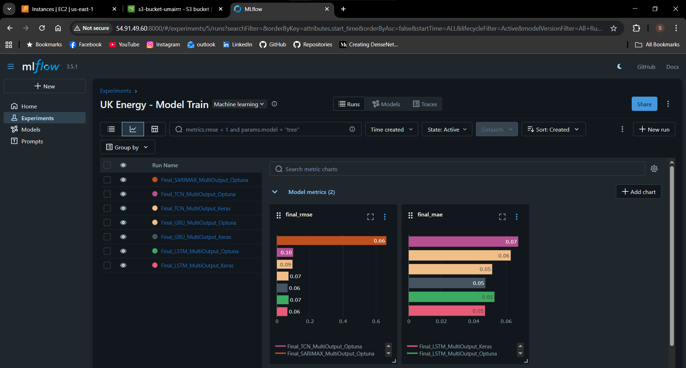

# MLOps Energy Forecasting System - Milestone 1🔋

UK energy demand forecasting system with real-time monitoring and automated ML pipeline deployment.

## Architecture Diagram

*MLOps Pipeline Architecture*


The pipeline consists of six main stages:

1. **Data Collection**: Using OpenMateo API with GitHub Actions for automation
2. **Feature Engineering**: Utilizing Feature Tools and Data Quality checks
3. **Feature Selection**: XGBoost regressor, Random Forest, PCA, and ACF/PACF analysis
4. **Model Training**: Multiple models including LSTM/GRU, Temporal CNN, SARIMAX, and Transformer
5. **Model Save**: BentoML archiving and S3 storage with MLflow tracking
6. **Model Forecasting**: Final predictions

Each stage is integrated with AWS S3 for artifact storage and version control, while DVC manages data versioning.

## Quick Start

```bash
# Clone the repository
git clone https://github.com/uma1r111/MLOps-ENERGY-Project.git
cd MLOps-ENERGY-Project

# Setup development environment
make dev
```

## Make Targets

| Target | Description |
|--------|-------------|
| `make dev` | Set up development environment, install dependencies |
| `make test` | Run unit tests with pytest |
| `make docker` | Build BentoML service Docker image |
| `make serve` | Serve BentoML model locally |
| `make bentoml-build` | Build model as deployable Bento |
| `make monitor` | Start monitoring stack (Prometheus + Grafana) |
| `make lint` | Run code quality checks (ruff, black) |
| `make clean` | Clean build artifacts and cache |

## ML Workflow Monitoring

### MLflow Tracking
MLflow tracking server: `http://localhost:8000`
- Latest model version: `v1.0.0` (registered in MLflow)
- Model Registry URI: `models:/energy_forecast/production`



### Data Drift Monitoring
Evidently AI Dashboard for data drift monitoring: `http://localhost:7000`


## Cloud Deployment

### AWS Services Integration

Our ML pipeline utilizes several core AWS services to store artifacts, run model serving, and handle event-driven tasks:

1. **AWS S3 for Data and Model Storage**
   
   - Stores training data and model artifacts
   - Enables versioned storage for reproducibility
   - Facilitates team collaboration
   
   Bucket Structure:
   ```
   energy-forecasting/
   ├── data/
   │   ├── raw/               # Original UK energy data
   │   ├── processed/         # Engineered features
   │   └── predictions/       # Model outputs
   ├── models/
   │   ├── lstm/             # LSTM model artifacts
   │   ├── gru/              # GRU model artifacts
   │   └── tcn/              # TCN model artifacts
   └── metadata/             # Training metrics and configs
   ```

2. **AWS EC2 for Model Serving**
   
   - Hosts the inference API (BentoML) for high-throughput, persistent serving
   - Auto-scaling group for handling load variations
   - Continuous monitoring via CloudWatch

   Instance Configuration:
   - Type: `t3.large` (2 vCPU, 8GB RAM)
   - AMI: Ubuntu 22.04 LTS
   - Security Group: Allows ports 80, 443, 3000 (BentoML)

3. **AWS Lambda for Serverless Tasks**
   
   - Handles event-driven jobs
   - Integrates with S3 events and CloudWatch Events
   - Cost-efficient for short-running tasks

### Reproducing the Setup

1. **Prerequisites**
   ```bash
   # Install AWS CLI
   curl "https://awscli.amazonaws.com/awscli-exe-linux-x86_64.zip" -o "awscliv2.zip"
   unzip awscliv2.zip
   sudo ./aws/install

   # Configure AWS credentials
   aws configure
   ```

2. **S3 Bucket Creation**
   ```bash
   aws s3 mb s3://energy-forecasting
   aws s3api put-bucket-versioning --bucket energy-forecasting --versioning-configuration Status=Enabled
   ```

3. **EC2 Setup**
   ```bash
   # Deploy EC2 instance using provided CloudFormation template
   aws cloudformation create-stack \
       --stack-name energy-forecast-stack \
       --template-file infra/ec2-stack.yaml \
       --parameters ParameterKey=EnvironmentName,ParameterValue=production
   ```

4. **BentoML Deployment**
   ```bash
   # Build and push BentoML service
   bentoml build
   bentoml containerize energy_forecast:latest
   
   # Deploy to EC2 (using provisioned instance)
   ./scripts/deploy_to_ec2.sh
   ```

### ML Workflow Integration

Our ML workflow interacts with AWS services in the following ways:

1. **Data Pipeline**
   - Historical data is pulled from OpenMateo API via Lambda (scheduled daily)
   - Raw data is stored in S3 (`data/raw/`)
   - Feature engineering triggered by S3 event on new data arrival
   - Processed features saved back to S3 (`data/processed/`)

2. **Training Pipeline**
   - Training jobs triggered by CloudWatch Events (weekly schedule)
   - Reads processed data from S3
   - Logs metrics to CloudWatch
   - Saves model artifacts to S3 (`models/`)
   - Updates model registry in MLflow

3. **Inference Pipeline**
   - BentoML service on EC2 loads latest model from S3
   - Real-time predictions via REST API
   - Batch predictions stored in S3 (`data/predictions/`)
   - Performance metrics logged to CloudWatch

4. **Monitoring**
   - CloudWatch dashboards track:
     - Model performance metrics
     - API latency and throughput
     - Resource utilization
   - Alerts configured for:
     - Model drift detection
     - Error rate thresholds
     - Resource constraints
### Service Architecture


## Model Serving & API Documentation

BentoML Service endpoint available at: `http://localhost:3000`


Service includes:
- Automatic OpenAPI documentation
- Built-in model monitoring
- Request logging and metrics
- Docker/Kubernetes deployment ready

Example usage:
```bash
# Using bentoml CLI
bentoml serve service:svc --production

# API request
curl -X POST "http://localhost:3000/predict" \
     -H "Content-Type: application/json" \
     -d '{"timestamp": "2025-10-31T12:00:00Z"}'
```

### Model Deployment
```bash
# Build model as deployable Bento
bentoml build

# Containerize the Bento
bentoml containerize energy_forecast:latest
```

The service is automatically packaged with:
- Model artifacts
- Python dependencies
- API configuration
- Environment settings

## Bonus Features Implemented

### Data Version Control (DVC)
- DVC integrated for dataset versioning
- Tracking multiple data files:
  - `uk_energy_data.csv`
  - `engineered_features.csv`
  - `selected_features.csv`
  - `predictions.csv`
- Enables reproducible data pipeline
- Efficient large file handling with S3 backend


### Infrastructure as Code (IaC) & Local Object Storage

- **CloudFormation IaC Sample:**
   - The file [`infra/mlops-energy-stack.yaml`](infra/mlops-energy-stack.yaml) is a ready-to-use AWS CloudFormation template tailored for this project.
   - It provisions:
     - An S3 bucket for model and artifact storage (with versioning and public access blocked)
     - An IAM role for Lambda execution with S3 access permissions
     - A Lambda function (Python 3.11) for event-driven ML tasks, conditionally created based on the presence of a model package
   - All resources are named and parameterized for the MLOps Energy Project, supporting secure, automated, and reproducible AWS infrastructure setup.
   - Place your model package in S3 or set the `ModelPackageExists` parameter as needed to control Lambda deployment.

**How to deploy:**
```bash
aws cloudformation create-stack \
  --stack-name mlops-energy-stack \
  --template-body file://infra/mlops-energy-stack.yaml \
  --parameters ParameterKey=ModelPackageExists,ParameterValue=false
```
This command provisions the S3 bucket, IAM role, and (optionally) Lambda function as defined in the template.

### Docker Compose

Our project leverages Docker Compose with environment profiles for efficient microservices orchestration:

#### Microservices Architecture

| Service | Port | Description |
|---------|------|-------------|
| Data Preprocessing | 8004 | Cleans, transforms, and prepares raw data for training |
| Model Training | 8000 | Trains and evaluates ML models on processed data |
| Prediction Client | 8003 | Provides a prediction API for serving trained models |
| Monitoring Service | 7000 | Displays system and model health/status information |

Each service has its own Dockerfile and includes a health endpoint for monitoring.

#### Docker Compose Profiles

The project uses Docker Compose v3.9 with profiles for managing multiple environments:

| Profile | Includes | Purpose |
|---------|----------|----------|
| dev | All services | For local development and debugging |
| test | All services | For integration and test automation |
| prod | All services | For deployment-ready, production mode |
| app | Data Preprocessing, Model Training, Prediction Client | For app-specific tasks |
| monitoring | Monitoring only | For isolated health/status checks |

#### Usage Commands

```bash
# Build and run all services
docker compose --profile dev up --build

# Run only application services
docker compose --profile app up --build

# Run monitoring service only
docker compose --profile monitoring up --build

# Run tests
docker compose --profile test up

# Run production setup
docker compose --profile prod up -d
```

#### Service Access Points

After running the containers, access services at:
- Data Preprocessing: `http://localhost:8004`
- Model Training: `http://localhost:8000`
- Prediction Client: `http://localhost:8003`
- Monitoring: `http://localhost:7000`

Each service exposes a `/health` endpoint returning:
```json
{
  "status": "healthy",
  "service": "service_name"
}
```

#### Cleanup

```bash
# Stop and remove all containers
docker compose down

# Remove unused images and networks
docker system prune -f
```

## FAQ

### Common Build Issues

1. **Docker build fails**
   - Increase Docker memory limit (recommended: 4GB)
   - Run `docker system prune` to clear space
   - Check Docker daemon is running

2. **Package installation errors**
   - Update pip: `python -m pip install --upgrade pip`
   - Install build tools: `apt-get install build-essential` (Linux)
   - Use Python 3.11 as specified in Dockerfile

### Platform Setup

#### Windows
1. Install WSL2: `wsl --install`
2. Install Docker Desktop with WSL2 backend
3. Install Make: `choco install make`
4. Install Python 3.11

#### MacOS
1. Install Homebrew: `/bin/bash -c "$(curl -fsSL https://raw.githubusercontent.com/Homebrew/install/HEAD/install.sh)"`
2. Install dependencies: `brew install make docker python@3.11`
3. Start Docker Desktop
4. Run: `brew link python@3.11`

