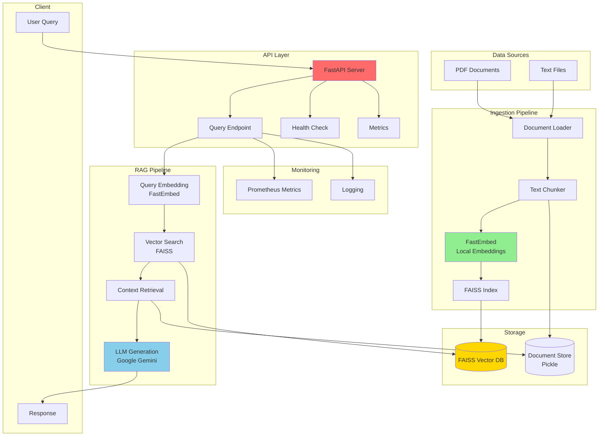
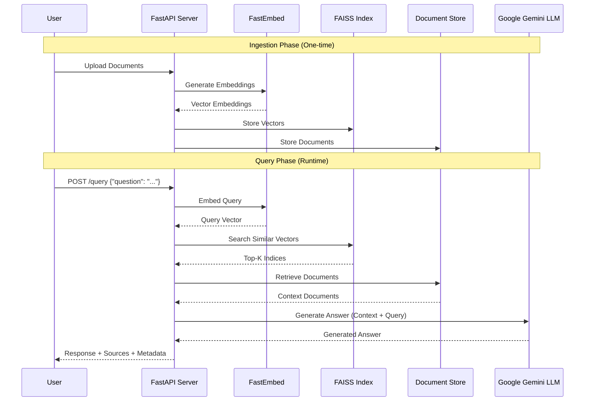

# RAG System Architecture

## System Architecture Diagram


## Data Flow Diagram


## Component Details

### 1. **Ingestion Pipeline**
- **Input**: PDF/TXT files from `data/documents/`
- **Processing**:
  - Load documents using LangChain loaders
  - Chunk text (1000 chars, 200 overlap)
  - Generate embeddings using FastEmbed (local)
  - Build FAISS index
  - Save index and documents
- **Output**: `data/faiss_index/` (index.faiss, documents.pkl)

### 2. **Inference API**
- **Endpoints**:
  - `POST /query`: Main RAG query endpoint
  - `GET /health`: Health check
  - `GET /metrics`: Prometheus metrics
- **Process**:
  1. Receive user query
  2. Embed query using FastEmbed
  3. Search FAISS for top-K similar documents
  4. Retrieve context documents
  5. Generate answer using Google Gemini
  6. Return answer with sources

### 3. **Technology Stack**
- **Embeddings**: FastEmbed (BAAI/bge-small-en-v1.5) - Local, no API key
- **Vector Store**: FAISS (Facebook AI Similarity Search)
- **LLM**: Google Gemini 2.0 Flash - Free tier
- **API**: FastAPI with Pydantic v2
- **Monitoring**: Prometheus metrics, structured logging

### 4. **Storage Architecture**
```
data/
├── documents/          # Source documents (input)
│   ├── *.pdf
│   └── *.txt
└── faiss_index/       # Generated index (output)
    ├── index.faiss    # Vector embeddings
    └── documents.pkl  # Document metadata
```